<div align="center">

<picture>
  <source media="(prefers-color-scheme: dark)" srcset="assets/logo-dark.svg">
  
</picture>

# Imposters

**Your dependencies, in disguise.**

Programmable mock servers for HTTP APIs and an in-memory S3, with stubs, hot-reload, JSONata templating, proxy recording and fault injection.

[](https://www.npmjs.com/package/imposters)
[](https://github.com/eliraz-refael/imposters/actions/workflows/check.yml)
[](LICENSE)

**[Try it in your browser →](https://eliraz-refael.github.io/imposters/#playground)** · [Docs](https://eliraz-refael.github.io/imposters/docs/) · [Roadmap](ROADMAP.md) (what is planned next, with an issue per item) · [Website](https://eliraz-refael.github.io/imposters/)



<sub>A real session, with <a href="examples/users-api.json"><code>examples/users-api.json</code></a> as <code>imposters.json</code>.</sub>

</div>

A modern service virtualization tool built with TypeScript and [Effect](https://effect.website). Create mock HTTP services for testing and development — a lightweight, programmable alternative inspired by [Mountebank](https://github.com/mountebank-testing/mountebank).

## What is Imposters?

Imposters lets you spin up fake HTTP servers ("imposters") that respond to requests based on configurable stubs. Each imposter listens on its own port and matches incoming requests against predicates, returning templated responses. Use it to isolate services in integration tests, prototype APIs, or simulate third-party dependencies.

## Features

- **Stub matching** — Match requests by method, path, headers, query params, or body using operators like `equals`, `contains`, `startsWith`, `matches`, and `exists`
- **Response templates** — Use `{{key}}` for simple substitution or `${expr}` for JSONata expressions that reference the incoming request
- **Multiple responses** — Cycle through responses sequentially, randomly, or repeat the last one
- **Proxy mode** — Passthrough to a real service or record responses as stubs
- **S3 emulator** — An in-memory S3 imposter (`"protocol": "S3"`) for the AWS SDK, with stubs for fault injection
- **Per-imposter admin UI** — HTMX-powered UI at each imposter's `/_admin` path
- **Admin dashboard** — Global dashboard at `/_ui` on the admin port
- **Config file support** — Declare imposters and stubs in a JSON file for repeatable setups
- **TypeScript client** — A typed client derived from the admin API definition (Effect's `HttpApiClient`), plus test helpers
- **Request logging** — Inspect captured requests per imposter with stats and percentile metrics
- **Node or Bun** — Runs on Node.js (`node:http`) by default; `--runtime bun` serves the admin API with `Bun.serve()`
- **Built on Effect** — Fiber-based concurrency, typed errors, and composable services

## Quick Start

```bash
# Install dependencies
bun install

# Start the admin server on the default port (2525)
bun tsx src/Program.ts start   # or, with the package installed: npx imposters start

# Create an imposter
curl -X POST http://localhost:2525/imposters \
  -H "Content-Type: application/json" \
  -d '{"name": "users-api", "port": 3000}'

# Add a stub
curl -X POST http://localhost:2525/imposters/<id>/stubs \
  -H "Content-Type: application/json" \
  -d '{
    "predicates": [
      { "field": "method", "operator": "equals", "value": "GET" },
      { "field": "path", "operator": "equals", "value": "/users/1" }
    ],
    "responses": [{
      "status": 200,
      "headers": { "content-type": "application/json" },
      "body": { "id": 1, "name": "Alice" }
    }]
  }'

# Start the imposter
curl -X PATCH http://localhost:2525/imposters/<id> \
  -H "Content-Type: application/json" \
  -d '{"status": "running"}'

# Hit your mock
curl http://localhost:3000/users/1
# => {"id":1,"name":"Alice"}
```

## Installation

```bash
npm install --save-dev imposters
```

Every release also attaches the same package to its [GitHub release](https://github.com/eliraz-refael/imposters/releases) as `imposters-<version>.tgz`. It contains the same files as the npm package. The publish workflow also compares its integrity hash with npm's and warns on a mismatch. Where the npm registry is not reachable, depend on the file directly. Any release works; substitute its version in both places:

```json
"imposters": "https://github.com/eliraz-refael/imposters/releases/download/v0.6.0/imposters-0.6.0.tgz"
```

## CLI Usage

```bash
imposters start [options]
```

| Option | Alias | Description |
|---|---|---|
| `--port <number>` | `-p` | Admin server port (default: `2525`, or `ADMIN_PORT` env var) |
| `--config <path>` | `-c` | Path to a JSON config file |
| `--host <address>` | | Address the admin server and every imposter bind to (default: `127.0.0.1`, or `IMPOSTERS_HOST` env var) |
| `--runtime <node\|bun>` | | Server runtime for the admin server: `node` (default, `node:http`) or `bun` (`Bun.serve()`, needs Bun). Imposters themselves always use `node:http`, which Bun also provides |

A flag wins over its environment variable. Settings with no flag come from the environment only:

| Variable | Default | Description |
|---|---|---|
| `ADMIN_PORT` | `2525` | Admin server port, when `--port` is not given |
| `IMPOSTERS_HOST` | `127.0.0.1` | Bind address, when `--host` is not given |
| `PORT_RANGE_MIN` / `PORT_RANGE_MAX` | `3000` / `4000` | Range a port is allocated from when an imposter is created without one |
| `MAX_IMPOSTERS` | `100` | Most imposters that can exist at once |

Every server binds the loopback address by default, so nothing off the machine can reach it. The admin API has no authentication and can create proxies, so pass `--host 0.0.0.0` only where the network is trusted, such as inside a container.

## Config File

Declare imposters and stubs declaratively. Pass the file with `--config`. Every imposter in it is created, given its stubs and started before the admin port opens; if any step fails, the CLI exits non-zero.

```json
{
  "admin": {
    "port": 2525,
    "portRangeMin": 3000,
    "portRangeMax": 4000,
    "maxImposters": 100,
    "logLevel": "info"
  },
  "imposters": [
    {
      "name": "users-api",
      "port": 3000,
      "stubs": [
        {
          "predicates": [
            { "field": "path", "operator": "equals", "value": "/health" }
          ],
          "responses": [
            { "status": 200, "body": { "status": "ok" } }
          ]
        }
      ]
    }
  ]
}
```

The `admin` block is optional and reserved: it is validated, but the CLI currently ignores it. Set the admin port, bind address and limits with the CLI flags and environment variables above.

## Examples

[`examples/`](examples/) holds config files you can run as they are, with `npx imposters start --config <file>`:

| File | What it shows | Try it |
|---|---|---|
| [`users-api.json`](examples/users-api.json) | A templated path parameter (the demo above) | `curl localhost:3000/users/42` → `{"id":"42","name":"Alice"}` |
| [`fault-injection.json`](examples/fault-injection.json) | `/orders` alternates 200 and 503 (`"responseMode": "sequential"`); `/slow` answers after a 2 s `delay` | `curl -w ' %{http_code}\n' localhost:3001/orders`, several times |
| [`s3.json`](examples/s3.json) | An in-memory S3 on port 7070 | Point the AWS SDK at `http://localhost:7070` with `forcePathStyle: true` |
| [`s3-fault-injection.json`](examples/s3-fault-injection.json) | An S3 on port 7071 where `GET /my-bucket/flaky.pdf` is throttled with a 503 `SlowDown`; every other request reaches the emulator | `curl localhost:7071/my-bucket/flaky.pdf` |
| [`vitest/users.test.ts`](examples/vitest/users.test.ts) | A vitest suite that mocks an API with `withImposter` | Copy it into a project with `imposters`, `effect` and `vitest`, then `npx vitest run` |

## API Reference

### System

| Method | Path | Description |
|---|---|---|
| `GET` | `/health` | Health check with system info |
| `GET` | `/info` | Server info, configuration, and feature flags |

### Imposters

| Method | Path | Description |
|---|---|---|
| `POST` | `/imposters` | Create an imposter |
| `GET` | `/imposters` | List imposters (supports `status` and `protocol` filters) |
| `GET` | `/imposters/:id` | Get imposter details |
| `PATCH` | `/imposters/:id` | Update imposter (name, status, port, proxy) |
| `DELETE` | `/imposters/:id` | Delete imposter. A running imposter answers `409` unless you pass `?force=true`, which stops it first |

### Stubs

| Method | Path | Description |
|---|---|---|
| `POST` | `/imposters/:id/stubs` | Add a stub. An `index` in the body places it in matching order (`0` is first); without one it goes last |
| `POST` | `/imposters/:id/stubs/preview` | Try a stub without adding it: how many unmatched requests it would catch |
| `GET` | `/imposters/:id/stubs` | List stubs |
| `PUT` | `/imposters/:id/stubs/:stubId` | Update a stub |
| `DELETE` | `/imposters/:id/stubs/:stubId` | Delete a stub |

### Requests & Stats

| Method | Path | Description |
|---|---|---|
| `GET` | `/imposters/:id/requests` | List captured requests |
| `GET` | `/imposters/:id/requests/:requestId/explain` | Why a captured request matches the stub it does, against the current stubs |
| `DELETE` | `/imposters/:id/requests` | Clear captured requests |
| `GET` | `/imposters/:id/stats` | Get imposter statistics |
| `DELETE` | `/imposters/:id/stats` | Reset imposter statistics |

`GET /imposters?stats=true` adds each imposter's `statistics` to the list.

Each captured request records what answered it in `response.outcome`: `stub`, `extension`, `proxy` or `unmatched` (the 404). When a stub answered, `response.responseIndex` says which of its responses it gave.

Statistics count from the imposter's last start. They include:

| Field | What it holds |
|---|---|
| `totalRequests`, `requestsPerMinute`, `requestsByMethod`, `requestsByStatusCode` | Request counts |
| `errorRate` / `serverErrorRate` | The share of answers that were 4xx or 5xx / 5xx only |
| `averageResponseTime`, `p50ResponseTime`, `p95ResponseTime`, `p99ResponseTime` | Latency in ms, over the last 1,000 requests |
| `timeline` | The last 15 minutes as 30 buckets of 30 s, oldest first. Each has a `start` time and `requests`, `serverErrors` and `unmatched` counts |
| `last15Minutes` | The timeline summed |
| `stubs` | One row per stub, in matching order: `hits`, `byResponse` (hits per response), `lastHitAt`, and `nextResponseIndex` (absent in `random` mode) |
| `unmatched` | Requests no stub, extension or proxy answered, grouped by `method` and `path` with a `count` and `lastSeenAt`. Most recently seen first. Up to 50 groups are kept; the least recently seen is dropped first |

Starting an imposter and `DELETE /imposters/:id/stats` reset all of these. Deleting a stub drops its row. Changing a stub's `responses` or `responseMode` restarts its counters and its response cycle. A change to its predicates only keeps both.

Stubs match in order, so where a new one goes matters. The body of `POST /imposters/:id/stubs` can carry an `index`, from `0` (first) to the number of stubs (last, the default); anything else is a `400`. It places the stub and is not stored with it. Inserting a stub leaves the others' counters and response cycles as they were.

`POST /imposters/:id/stubs/preview` takes the same body as adding a stub and answers `matched` and `total`: how many of the imposter's unmatched requests (the `unmatched` groups above, minus any a stub now answers) the candidate would catch, out of all of them. `sample` is the candidate's first response to the most recent request it matches, templated but not delayed. `error` reports a predicate that would fail at runtime, such as an invalid regex.

`GET /imposters/:id/requests/:requestId/explain` checks a captured request against the current stubs, in matching order. Each stub lists its predicates with the `expected` value, the request's `actual` value and whether it `matched`. `matchedStubId` is the stub that would answer it now and `loggedMatchedStubId` the one that did; `agreesWithLog` is `false` when the stubs have changed since.

## Stub Matching

Each stub has an array of **predicates** that are AND-combined. A request matches a stub when all predicates pass. Stubs are evaluated in order — the first match wins.

### Predicate fields

`method` | `path` | `headers` | `query` | `body`

### Operators

| Operator | Description |
|---|---|
| `equals` | Exact match (deep subset match for objects/body) |
| `contains` | Substring match |
| `startsWith` | Prefix match |
| `matches` | Regular expression match |
| `exists` | Field is present (ignores `value`) |

All operators support `caseSensitive` (default: `true`).

### Examples

```json
// Match GET requests to any path starting with /api/
{
  "predicates": [
    { "field": "method", "operator": "equals", "value": "GET" },
    { "field": "path", "operator": "startsWith", "value": "/api/" }
  ],
  "responses": [{ "status": 200, "body": { "ok": true } }]
}
```

```json
// Match requests with a specific header
{
  "predicates": [
    { "field": "headers", "operator": "exists", "value": { "authorization": "" } }
  ],
  "responses": [{ "status": 200 }]
}
```

```json
// Match POST with a JSON body subset
{
  "predicates": [
    { "field": "method", "operator": "equals", "value": "POST" },
    { "field": "body", "operator": "equals", "value": { "action": "create" } }
  ],
  "responses": [{ "status": 201 }]
}
```

## Response Templates

Response bodies support two kinds of dynamic substitution:

### `{{key}}` — Simple substitution

Reference flattened request context values:

```json
{
  "responses": [{
    "body": {
      "echo": "You requested {{request.path}} with method {{request.method}}",
      "token": "{{request.headers.authorization}}",
      "search": "{{request.query.q}}"
    }
  }]
}
```

Available keys follow the pattern `request.method`, `request.path`, `request.headers.<name>`, `request.query.<name>`, and `request.body.<path>` for nested body fields.

### `${expr}` — JSONata expressions

Use [JSONata](https://jsonata.org/) for computed values. The expression context is `{ request: { method, path, headers, query, body } }`.

```json
{
  "responses": [{
    "body": {
      "greeting": "${\"Hello, \" & request.query.name}",
      "itemCount": "${$count(request.body.items)}",
      "uppercasePath": "${$uppercase(request.path)}"
    }
  }]
}
```

If an entire string is a single `${...}` expression, the raw result type is preserved (number, object, etc.). When mixed with other text, results are concatenated as strings.

## Proxy Mode

Configure an imposter to forward unmatched requests to a real backend.

```json
{
  "name": "proxied-api",
  "port": 3000,
  "proxy": {
    "targetUrl": "https://api.example.com",
    "mode": "passthrough"
  }
}
```

### Modes

| Mode | Description |
|---|---|
| `passthrough` | Forward requests to the target and return the response as-is |
| `record` | Forward requests and automatically save responses as new stubs |

### Proxy options

| Option | Default | Description |
|---|---|---|
| `targetUrl` | *(required)* | Target base URL |
| `mode` | `passthrough` | `passthrough` or `record` |
| `addHeaders` | — | Headers to add to proxied requests |
| `removeHeaders` | `[]` | Headers to strip before proxying |
| `followRedirects` | `true` | Follow HTTP redirects |
| `timeout` | `10000` | Request timeout in milliseconds (100–60000) |

## S3 Emulator

An imposter created with `"protocol": "S3"` is an in-memory S3 service. Point an AWS SDK at it with path-style URLs; any credentials and region work, since signatures are not checked. [`examples/s3.json`](examples/s3.json) starts one on port 7070:

```json
{
  "imposters": [
    { "name": "local-s3", "port": 7070, "protocol": "S3" }
  ]
}
```

```bash
npx imposters start --config examples/s3.json
```

```ts
import { S3Client } from "@aws-sdk/client-s3"

const s3 = new S3Client({
  region: "us-east-1",
  endpoint: "http://127.0.0.1:7070",
  forcePathStyle: true, // required: virtual-hosted URLs are not supported
  credentials: { accessKeyId: "local", secretAccessKey: "local-secret" }
})
```

### Supported operations

| Operation | Request | Notes |
|---|---|---|
| ListBuckets | `GET /` | |
| CreateBucket | `PUT /<bucket>` | An existing bucket is `409 BucketAlreadyOwnedByYou`. Bucket naming rules are enforced (`400 InvalidBucketName`) |
| HeadBucket | `HEAD /<bucket>` | |
| DeleteBucket | `DELETE /<bucket>` | A bucket with objects is `409 BucketNotEmpty` |
| GetBucketVersioning | `GET /<bucket>?versioning` | Always an empty configuration: versioning is never enabled |
| PutBucketOwnershipControls | `PUT /<bucket>?ownershipControls` | Accepted (`200`) and discarded: nothing is stored or enforced |
| PutBucketPolicy | `PUT /<bucket>?policy` | Accepted (`204`) and discarded: nothing is stored or enforced |
| ListObjectsV2 | `GET /<bucket>?list-type=2` | `prefix`, `max-keys` and `encoding-type=url`. A listing that would be truncated is `501`, not paginated |
| PutObject | `PUT /<bucket>/<key>` | Stores the bytes exactly, and the `Content-Type` (default `binary/octet-stream`). The ETag is the quoted MD5 |
| GetObject / HeadObject | `GET` / `HEAD /<bucket>/<key>` | `ETag`, `Content-Type`, `Content-Length`, `Last-Modified`. `If-None-Match` answers `304`. No checksum headers |
| CopyObject | `PUT /<bucket>/<key>` + `x-amz-copy-source` | Keeps the body and type. A missing source is `404 NoSuchKey` |
| DeleteObject | `DELETE /<bucket>/<key>` | |
| DeleteObjects | `POST /<bucket>?delete` | Quiet and verbose. A key that is not there counts as deleted, as on S3 |

Errors are S3 `<Error>` documents (`Code`, `Message`, `Resource`, `RequestId`) with S3's status codes; HEAD errors have no body.

**Answered with `501 NotImplemented`:** other bucket configuration (`?publicAccessBlock`, `?encryption`, `?lifecycle`, `?cors`, versioning `PUT`, ...), reading a policy or ownership controls back, multipart uploads, presigned URLs, `aws-chunked` / `STREAMING-*` payloads, `Range` and conditional headers other than `If-None-Match`, ListObjectsV2 pagination and `delimiter`, and any other operation or query parameter the emulator does not know. It never guesses: an unsupported request fails loudly instead of answering wrong.

**Expected owner:** every bucket belongs to whoever asks. A request whose `x-amz-expected-bucket-owner` (or `x-amz-source-expected-bucket-owner`, on a copy) differs from the access key id it is signed with is `403 AccessDenied`, as S3 answers an owner mismatch; the access key id stands in for S3's account id. An unsigned request has no requester to compare with, so it is not checked. The check runs first, before any other answer.

**Keys with dot segments do not survive.** The server parses each request URL with the WHATWG `URL` parser, which resolves `.` and `..` path segments (even percent-encoded as `%2e`) before the emulator sees the path. A key such as `a/../b` is stored as `b`, and `DELETE /bucket/k/..` becomes a DeleteBucket. Avoid such keys.

**Not checked:** SigV4 signatures. No virtual-hosted URLs, CORS, or versioning.

**State is per start.** Buckets and objects live in memory in the running imposter. Stopping or restarting it (or the server) empties it. It is a test double, never a store.

### Fault injection with stubs

Stubs are matched before the emulator, so a stub on an S3 imposter overrides one request and everything else still reaches S3. A 503 `SlowDown` for one key:

```json
{
  "predicates": [
    { "field": "method", "operator": "equals", "value": "GET" },
    { "field": "path", "operator": "equals", "value": "/my-bucket/flaky.pdf" }
  ],
  "responses": [{
    "status": 503,
    "headers": { "content-type": "application/xml" },
    "body": "<Error><Code>SlowDown</Code><Message>Please reduce your request rate.</Message></Error>"
  }]
}
```

The SDK surfaces it as an `S3ServiceException` named `SlowDown` (set `maxAttempts: 1` to see it without retries). A `"delay"` on the response instead trips the client's request timeout.

## Programmatic Usage

### TypeScript client

The client takes decoded values: branded ports and names, with defaults filled in. The simplest way to build a payload is to decode it through the request schema:

```typescript
import { ImpostersClient, ImpostersClientFetchLive } from "imposters/client/ImpostersClient"
import { CreateImposterRequest } from "imposters/schemas/ImposterSchema"
import { CreateStubRequest } from "imposters/schemas/StubSchema"
import { Effect, Schema } from "effect"

const program = Effect.gen(function*() {
  const client = yield* ImpostersClient

  const imposter = yield* client.imposters.createImposter({
    payload: Schema.decodeSync(CreateImposterRequest)({ name: "my-api", port: 4000 })
  })

  yield* client.imposters.addStub({
    params: { imposterId: imposter.id },
    payload: Schema.decodeSync(CreateStubRequest)({
      predicates: [{ field: "path", operator: "equals", value: "/hello" }],
      responses: [{ status: 200, body: { hello: "world" } }]
    })
  })

  yield* client.imposters.updateImposter({
    params: { id: imposter.id },
    payload: { status: "running" }
  })
})

program.pipe(
  Effect.provide(ImpostersClientFetchLive("http://localhost:2525")),
  Effect.runPromise
)
```

### Test helpers

The `withImposter` helper manages the lifecycle of a test imposter — create, configure stubs, start, run your test, then clean up:

```typescript
import { makeTestServer, withImposter } from "imposters/client/testing"
import { Effect } from "effect"

const { clientLayer } = makeTestServer() // or makeTestServer({ extensions: [...] })

const test = withImposter(
  {
    port: 4001,
    name: "test-api",
    stubs: [{
      predicates: [
        { field: "path", operator: "equals", value: "/greet" }
      ],
      responses: [{ status: 200, body: { message: "hi" } }]
    }]
  },
  (ctx) =>
    Effect.gen(function*() {
      const res = yield* Effect.promise(() =>
        fetch(`http://localhost:${ctx.port}/greet`)
      )
      return res.status // assert on it, e.g. expect(res.status).toBe(200)
    })
)

Effect.provide(test, clientLayer).pipe(Effect.runPromise)
```

## Admin UI

- **`/_ui`** on the admin port — Global dashboard showing all imposters
- **`/_admin`** on each imposter port — Per-imposter UI with stubs, captured requests, and stats

Both UIs are server-rendered and use HTMX, which the page loads from `unpkg.com`. There is nothing to install, but the browser must be able to reach unpkg.com; without it the pages still render, but their forms and buttons (create, start, stop, delete, refresh) do nothing.

## Development

```bash
bun check          # Type check
bun run test       # Run tests (vitest)
bun lint           # Lint
bun lint-fix       # Lint with auto-fix
bun coverage       # Test coverage
```

See [CONTRIBUTING.md](CONTRIBUTING.md) before opening a pull request, and [DEVELOPMENT.md](DEVELOPMENT.md) for how the code is put together.

## Architecture

Imposters is built entirely on [Effect](https://effect.website) 4:

- **Effect services** — All components (`ImposterRepository`, `PortAllocator`, `ProxyService`, `MetricsService`, `RequestLogger`, `FiberManager`) are Effect services composed via layers
- **Fiber concurrency** — Each running imposter is managed as an Effect Fiber via `FiberMap`, allowing independent start/stop lifecycle
- **Typed admin API** — Defined declaratively with `HttpApi`, `HttpApiGroup` and `HttpApiEndpoint` from `effect/unstable/httpapi`, with schema-derived request validation, typed errors and OpenAPI. The client is derived from the same definition
- **Plain handlers for imposters** — Each imposter is an `async (request: Request) => Response` that matches stubs linearly over a `Ref`, so stub changes apply without a restart
- **CLI** — `effect/unstable/cli` for commands and option parsing
- **Server runtime** — `node:http` by default; `Bun.serve()` for the admin server with `--runtime bun`
- **Extensions** — Non-HTTP protocols (the S3 emulator) plug in behind stub matching
- **JSONata** — Expression evaluation in response templates

## License

MIT
